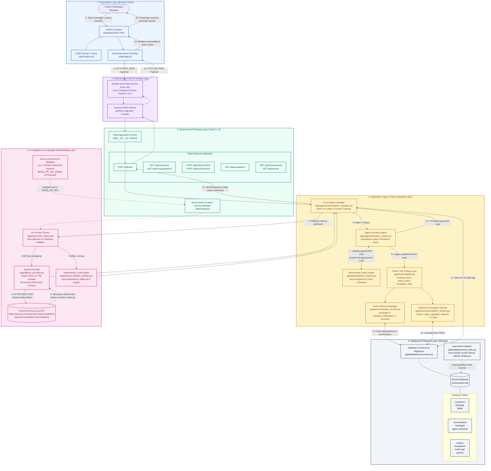

# System Architecture — Customer Resolution Agent

## AI-Powered Airline Customer Support System

---

## 1. Complete System Architecture Diagram (Mermaid)



---

## 2. Technology Stack Breakdown

| Layer | Technologies & Tools Actually Used |
| :--- | :--- |
| **Frontend / Presentation** | HTML5, CSS3 (Aviation theme, CSS grid/flexbox), Vanilla JavaScript (ES6+ fetch API) |
| **Server & Hosting** | Render Web Service (Free tier container), Gunicorn 26.2.0 WSGI server, Python 3.11.9 runtime |
| **Backend Framework** | Python 3.11 / 3.13, Flask 3.1.0, Flask Blueprints (`app/api/`), `pathlib` path resolution |
| **Application Logic** | Custom Agent Architecture (`ConversationManager`, `DecisionEngine`, `PolicyEngine`, `ActionService`) |
| **AI Integration** | Groq Cloud API (`llama-3.3-70b-versatile` via OpenAI-compatible `/v1/chat/completions`), `requests` library |
| **Offline Fallback** | Deterministic Local Reasoning Engine (`LocalFallbackProvider`), 0 external API dependencies |
| **Security & Secrets** | `python-dotenv` (`.env`), Render Environment Variables, `.gitignore` credential masking |
| **Database & ORM** | SQLite3 (`conversation.db`), raw SQL with parameters, connection pooling, auto-seeding |
| **Testing** | Pytest 9.1.1, Pytest-Cov 7.1.0 (23 unit and scenario test cases, 100% pass) |

---

## 3. End-to-End Customer Query Request-Response Workflow

```
Step 1 (Customer Action):
The passenger (e.g., Priya Nair) opens the web console, selects her profile, and enters:
"I am furious. My flight was cancelled. I want a full cash refund plus a free upgrade to business class on my return flight."

Step 2 (Browser / Client Dispatch):
static/app.js packages the message, customer ID ("priya"), and session state into a JSON payload and dispatches an asynchronous HTTP POST request to /api/chat.

Step 3 (Web Server & Gateway):
Render routes the request to the Gunicorn WSGI process, which passes the request to the Flask application instance created via the application factory in app/__init__.py.

Step 4 (API Routing & History Retrieval):
The route handler in app/api/chat_routes.py invokes ConversationManager.handle_message(). It loads the passenger's conversation history and disruption facts from SQLite.

Step 5 (AI Integration & Intent Parsing):
ProviderFactory retrieves the GROQ_API_KEY stored securely in environment variables (never exposed in source code or to the browser). It sends a REST request to Groq's OpenAI-compatible endpoint:
https://api.groq.com/openai/v1/chat/completions
Groq analyzes the query and returns structured JSON specifying:
- Primary Intent: refund_request
- Secondary Intent: upgrade_request
- Emotion: furious
- Urgency: high

Step 6 (Policy Guardrail Engine Evaluation):
The LLM output is NOT directly executed. It is passed to DecisionEngine and PolicyEngine, which enforce the strict Assignment 3 PDF rules:
- Cancellation Policy (POL-CANCEL-01): Entitled to full refund within 7 business days to original payment method, or free 24-hour rebooking.
- Loyalty Policy (POL-LOYALTY-01): Gold tier grants priority rebooking, but explicitly prohibits complimentary cabin upgrades.
- Mandatory Escalation (POL-PROHIBIT-01): The unauthorized business-class upgrade request is intercepted and converted into a human supervisor ticket.

Step 7 (Safe Tool & Database Execution):
- The agent calls create_refund_request() via the ToolRegistry, placing the refund action in "awaiting_confirmation" status.
- The agent calls create_escalation(), recording a supervisor ticket under category "unauthorized_compensation".
- Idempotency keys prevent duplicate refund records.
- Dialogue turns and audit events are saved to conversation.db.

Step 8 (Response Transmission & Rendering):
The Flask backend returns HTTP 200 with the synthesized response, cited policy IDs, and telemetry. static/app.js renders:
- An empathetic agent message explaining policy limits.
- An interactive Action Confirmation Card with [✓ Approve & Execute] and [✗ Decline] buttons.
- A notification badge showing that the upgrade request was escalated to a supervisor.
- Updated telemetry in the inspector panel.
```
